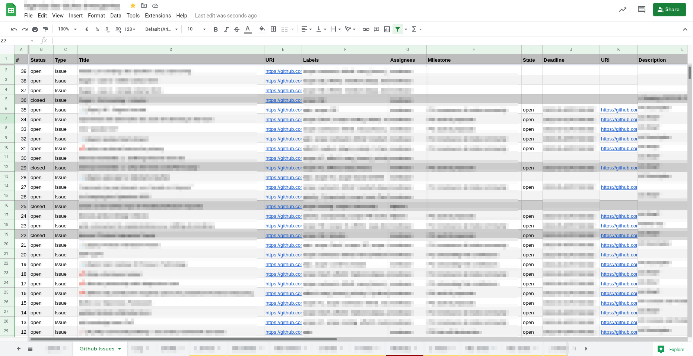
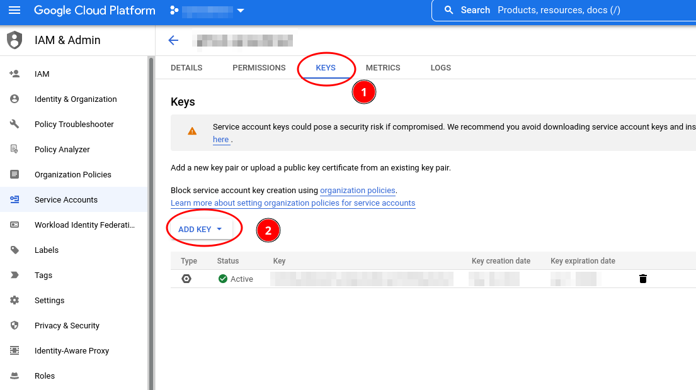
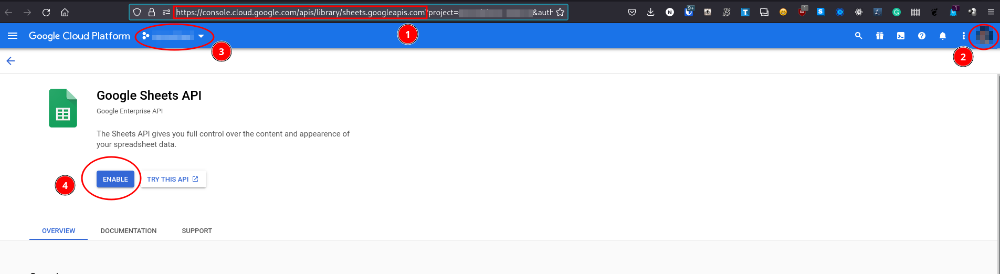
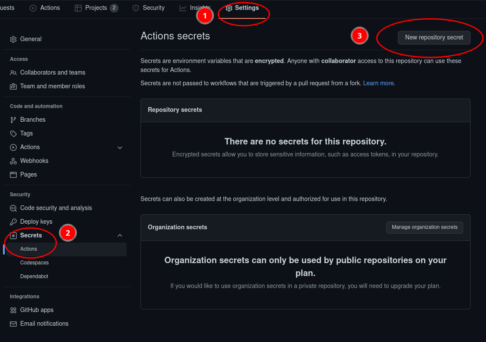
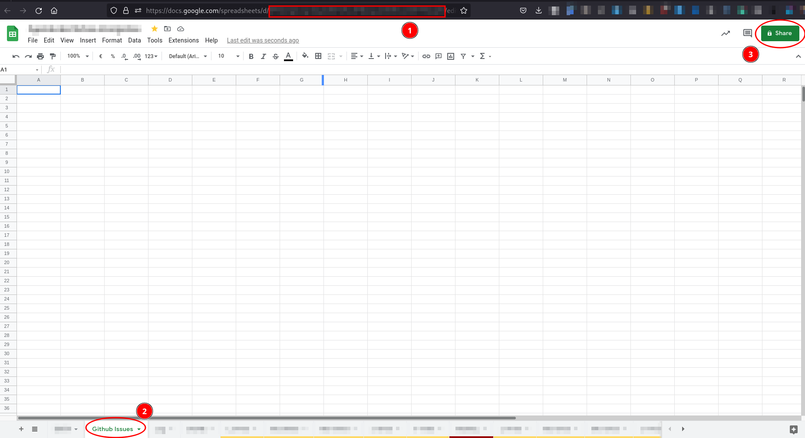

# Google Spreadsheet Synchronizer

Github Action to continuously export issues and pull requests data to a Google Spreadsheet



> A project initiated by [ViRGiL175](https://github.com/ViRGiL175/github-project-issue-to-sheets) with contributions from [Lityx](https://github.com/Lityx/github-project-issue-to-sheets).

## Quick Start

Create a [Github Action workflow](https://docs.github.com/en/actions/quickstart) as follow:

```yml
name: sync-issues-spreadsheet

on:
  workflow_dispatch:
  issues:
    types:
      [
        opened,
        deleted,
        transferred,
        closed,
        reopened,
        assigned,
        unassigned,
        labeled,
        unlabeled,
      ]

jobs:
  spreadsheet-sync:
    runs-on: ubuntu-latest
    name: sync-issues-spreadsheet
    steps:
      - name: sync-issues-spreadsheet
        id: spreasheet-sync
        uses: niketsourabh/spreadsheet-sync@v3
        env:
          GITHUB_TOKEN: ${{ secrets.GITHUB_TOKEN }}
        with:
          google-api-service-account-credentials: ${{ secrets.GOOGLE_SERVICE_ACCOUNT_DATA }}
          document-id: "<YOUR SPREADSHEET ID>"
          sheet-name: "<NAME OF THE SHEET WHEN DATA WILL BE EXPORTED>"
          mode: "issues"
```

**Don't forget to fulfill the [requirements](#requirements-step-by-step).**

## Options

| key                                      | description                               | mandatory             |
| ---------------------------------------- | ----------------------------------------- | --------------------- |
| `google-api-service-account-credentials` | Google service account credentials (JSON) | yes                   |
| `document-id`                            | ID of your Google Spreadsheet             | yes                   |
| `sheet-name`                             | name of the sheet to export to            | yes                   |
| `mode`                                   | sync mode to use                          | no (`all` by default) |

### Modes

Possible values for the `mode` option are:

- `all`: export all issues and PRs
- `issues`: export issues only (exclude pull requests)
- `milestone_issues`: only export issues associated with an active milestone

## Requirements (Step-by-step)

### Google Credentials

Open [Google IAM & Admin](https://console.cloud.google.com/iam-admin/) and [Create a Google Cloud Project](https://developers.google.com/workspace/guides/create-project) if you don't have one.

Select this project, [create service account credentials](https://developers.google.com/workspace/guides/create-credentials#service-account), and save the associated JSON




Finally, you need to enable the API by visiting <https://console.cloud.google.com/apis/library/sheets.googleapis.com> to avoid an `accessNotConfigured` error. Make sure to select the right user and project before clicking on the "enable" button.



### Encrypted Secret

Store these JSON Credentials in an [Encrypted Secret](https://docs.github.com/en/actions/security-guides/encrypted-secrets#creating-encrypted-secrets-for-a-repository) for your Github repository (cf. the `google-api-service-account-credentials` option).



> The `GITHUB_TOKEN` secret is set by default, so you don't need to define one. Owerver, you still need to pass it as an environement variable to the Github job using `env` as shown in the [example worflow](#quick-start).

### Spreadsheet

Create a new (or open an existing) spreadsheet document and note its ID (the part of the URL between `/d/` and `/edit`). Use this ID for the `document-id` option.

Create a dedicated sheet for GitHub Issues data (cf. the `sheet-name` option).

Add the Google API Service Account email to your document with editor access.


